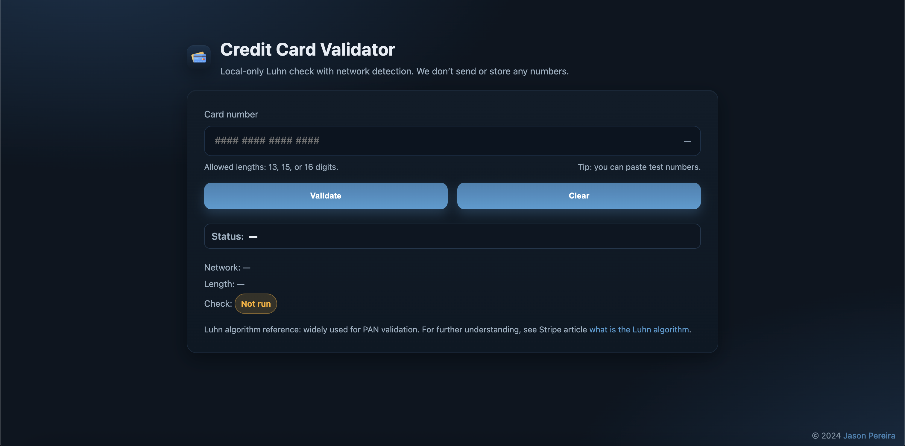

# 💳 Credit Card Validator  

A simple, secure, and fully client-side **Credit Card Validator** that uses the **Luhn Algorithm** to verify card numbers and detect major payment networks (Visa, Mastercard, American Express, Discover).  

Built with **HTML**, **CSS**, and **JavaScript**, this tool runs entirely in your browser — no data is ever sent to a server.

---

## 📸 Screenshot

---

## 🖥️ Demo  

🔗 **Live Site:** [https://cardverifier.netlify.app/](https://cardverifier.netlify.app/)
